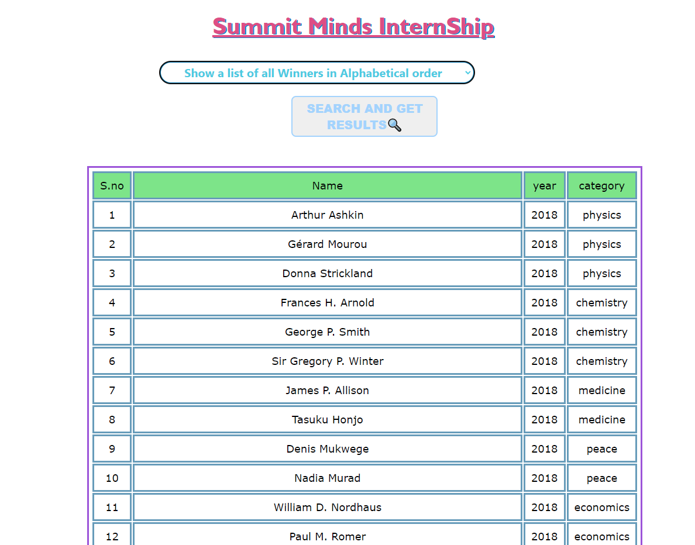

# Summit-Minds-InternShip 🚀
This is a repository for problem statement given by summit minds for internship selection**

## SOURCES 📂
- [Problem Statement] 
- [JSON data]

## Overview 👀 of project

## OPTION 1
#### BEFORE SEARCH

#### AFTER SEARCH

## OPTION 2
#### BEFORE SEARCH

#### AFTER SEARCH

## OPTION 3
#### BEFORE SEARCH

#### AFTER SEARCH

## OPTION 4
#### BEFORE SEARCH

#### AFTER SEARCH

## DISPLAYING SEARCH RESULT ERROR ⚠️

### Run Locally 💻 Using Live Server extension in VS code or by starting npm server (:

[Problem Statement]: https://docs.google.com/document/d/1Vrc2_cw3AxKVWCWx5OIXftSDwz4FBVPDnBqe9SMcxEU/edit
[JSON data]: https://drive.google.com/open?id=1udrhAEPkI0F2IFfcHa9qcpDmdoLFGMST
